# MarketMind AI

AI-powered financial research platform built with FastAPI, PostgreSQL, Qdrant, Redis and NVIDIA NIM.

## Features

- AI-generated equity research reports
- Stock sentiment analysis
- Earnings transcript analysis
- RAG-powered financial research
- Watchlists and alerts
- Background job processing
- Vector search with Qdrant
- PostgreSQL + pgvector support

## Tech Stack

- FastAPI
- PostgreSQL
- SQLAlchemy
- Redis
- Qdrant
- NVIDIA NIM
- Docker
- GitHub Actions

## 1. Entity-Relationship Diagram (ERD)

Below is the complete relationship schema.

```mermaid
erDiagram
    users ||--o{ watchlists : "creates"
    users ||--o{ research_runs : "starts"
    users ||--o{ research_reports : "authors"
    users ||--o{ ai_model_usage : "incurs charge"
    users ||--o{ scheduled_jobs : "schedules"
    users ||--o{ alerts : "configures"

    stocks ||--o{ stock_prices : "has historical prices"
    stocks ||--o{ company_fundamentals : "reports financials"
    stocks ||--|| company_profiles : "detailed by"
    stocks ||--|| analyst_consensus : "rated by"
    stocks ||--o{ watchlist_items : "added to"
    stocks ||--o{ market_events : "affected by"
    stocks ||--o{ research_runs : "analyzed in"
    stocks ||--o{ research_reports : "subject of"
    stocks ||--o{ sentiments : "rated for"
    stocks ||--o{ news_article_stocks : "mentioned in"
    stocks ||--o{ scheduled_jobs : "monitored by"
    stocks ||--o{ alerts : "tracked by"

    watchlists ||--|{ watchlist_items : "contains"
    
    news_articles ||--o{ news_article_stocks : "references"
    news_articles ||--o{ sentiments : "sentiment source"
    earnings_transcripts ||--o{ sentiments : "sentiment source"
    research_reports ||--o{ sentiments : "sentiment source"

    news_articles ||--o{ embeddings : "has semantic chunks"
    earnings_transcripts ||--o{ embeddings : "has semantic chunks"
    research_reports ||--o{ embeddings : "has semantic chunks"

    research_runs ||--o{ research_reports : "generates"
    research_runs ||--o{ research_sources : "references inputs"
    research_runs ||--o{ ai_model_usage : "executes LLM calls"

    research_reports ||--|{ research_report_sections : "divided into"

    research_sources ||--o{ news_articles : "uses news"
    research_sources ||--o{ earnings_transcripts : "uses transcript"
    research_sources ||--o{ company_fundamentals : "uses fundamental"

    users {
        uuid id PK
        varchar email UK
        varchar password_hash
        varchar first_name
        varchar last_name
        timestamptz created_at
        timestamptz updated_at
    }
    stocks {
        uuid id PK
        varchar ticker UK
        varchar name
        varchar exchange
        varchar sector
        varchar industry
        boolean is_active
        timestamptz created_at
        timestamptz updated_at
    }
    company_profiles {
        uuid id PK
        uuid stock_id FK "1-to-1 UNIQUE"
        text description
        varchar headquarters
        varchar ceo
        int employees
        varchar website
        int founded_year
        numeric market_cap
        numeric shares_outstanding
        timestamptz updated_at
    }
    analyst_consensus {
        uuid id PK
        uuid stock_id FK "1-to-1 UNIQUE"
        int buy_count
        int hold_count
        int sell_count
        numeric average_target_price
        timestamptz updated_at
    }
    stock_prices {
        uuid id PK
        uuid stock_id FK
        date price_date
        numeric open_price
        numeric high_price
        numeric low_price
        numeric close_price
        bigint volume
        numeric adjusted_close
        timestamptz created_at
        timestamptz updated_at
    }
    company_fundamentals {
        uuid id PK
        uuid stock_id FK
        date report_date
        period_type_enum period_type
        numeric revenue
        numeric net_income
        numeric eps
        numeric ebitda
        numeric assets
        numeric liabilities
        numeric cash_flow
        jsonb metadata
        timestamptz created_at
        timestamptz updated_at
    }
    news_articles {
        uuid id PK
        varchar title
        text content
        text summary
        varchar source_name
        text url
        timestamptz published_at
        jsonb metadata
        timestamptz created_at
        timestamptz updated_at
    }
    news_article_stocks {
        uuid article_id FK
        uuid stock_id FK
    }
    earnings_transcripts {
        uuid id PK
        uuid stock_id FK
        int quarter
        int year
        date publish_date
        text raw_text
        jsonb sections
        jsonb metadata
        timestamptz created_at
        timestamptz updated_at
    }
    research_reports {
        uuid id PK
        uuid user_id FK
        uuid stock_id FK
        uuid run_id FK
        varchar title
        text summary
        numeric target_price
        rating_type_enum rating
        report_status_enum status
        timestamptz created_at
        timestamptz updated_at
    }
    research_report_sections {
        uuid id PK
        uuid report_id FK
        report_section_type_enum section_type
        text content
        timestamptz created_at
    }
    sentiments {
        uuid id PK
        uuid stock_id FK
        source_type_enum source_type
        uuid source_id
        numeric sentiment_score
        sentiment_label_enum sentiment_label
        text explanation
        numeric confidence_score
        timestamptz created_at
    }
    watchlists {
        uuid id PK
        uuid user_id FK
        varchar name
        text description
        timestamptz created_at
        timestamptz updated_at
    }
    watchlist_items {
        uuid id PK
        uuid watchlist_id FK
        uuid stock_id FK
        timestamptz added_at
        int sort_order
    }
    research_runs {
        uuid id PK
        uuid user_id FK
        uuid stock_id FK
        varchar trigger_type
        run_status_enum status
        timestamptz started_at
        timestamptz completed_at
        text error_message
        jsonb config
        timestamptz created_at
    }
    research_sources {
        uuid id PK
        uuid run_id FK
        source_type_enum source_type
        uuid source_id
        timestamptz created_at
    }
    scheduled_jobs {
        uuid id PK
        uuid user_id FK
        uuid stock_id FK
        varchar job_name
        varchar cron_expression
        boolean is_active
        timestamptz last_run_at
        timestamptz created_at
        timestamptz updated_at
    }
    alerts {
        uuid id PK
        uuid user_id FK
        uuid stock_id FK
        alert_type_enum alert_type
        numeric target_value
        boolean is_triggered
        timestamptz created_at
    }
    market_events {
        uuid id PK
        uuid stock_id FK
        varchar event_type
        timestamptz event_date
        varchar title
        text description
        event_impact_enum impact_level
        timestamptz created_at
        timestamptz updated_at
    }
    ai_model_usage {
        uuid id PK
        uuid run_id FK
        uuid user_id FK
        varchar model_name
        int prompt_tokens
        int completion_tokens
        numeric cost
        varchar action_performed
        timestamptz created_at
    }
    embeddings {
        uuid id PK
        source_type_enum source_type
        uuid source_id
        int chunk_index
        text content_chunk
        varchar embedding_model
        int embedding_dimension
        vector embedding
        timestamptz created_at
    }
```



---

## 2. Table Modules & Core Structures

The schema is divided into the following scopes:

### A. Equities Core (Ticker, Profiles, Consensus, Prices, Fundamentals)
- **`stocks`**: Base lookup table for equities.
- **`company_profiles`**: Detailed corporate profile data (CEO, headquarters, employees, website, market capitalization, shares outstanding) linked 1-to-1 with `stocks`.
- **`analyst_consensus`**: Extraneous analyst recommendations (buy, hold, sell counts) and consensus targets linked 1-to-1 with `stocks`.
- **`stock_prices`**: Optimized time-series daily charts. Constraints ensure logical pricing parameters (`high_price >= low_price`).
- **`company_fundamentals`**: Stores SEC/filing financial statement values. The `metadata` JSONB block allows flexibility for custom financial metrics like debt/equity ratios.

### B. News, Transcripts, & Catalyst Events
- **`news_articles`**: Aggregates external financial reports. Includes full-text search indexes on the body.
- **`news_article_stocks`**: Joint mapping representing which stocks are discussed in which news articles (resolves many-to-many relationship mappings).
- **`earnings_transcripts`**: Stores parsed quarterly Earnings Call scripts. A JSONB field structures speaker-by-speaker transcript records.
- **`market_events`**: Tracks catalysts, corporate actions, and macro indicators.

### C. Watchlists, Scheduled Jobs & Alerts
- **`users`**: Contains authentication credentials and profile information.
- **`watchlists`** & **`watchlist_items`**: Enables users to configure custom portfolios.
- **`scheduled_jobs`**: Job tracking configurations to execute automated research generations based on cron triggers.
- **`alerts`**: User-defined price, sentiment, or reports notification conditions.

### D. AI Execution & Vector Embeddings
- **`research_runs`**: Represents execution instances of research agents.
- **`research_reports`**: Main report meta references.
- **`research_report_sections`**: Detailed breakdowns of report contents into structural segments (e.g. `EXECUTIVE_SUMMARY`, `BULL_CASE`, `RISKS`, etc.) linked to `research_reports` via foreign key.
- **`research_sources`**: Auditing map recording which articles/transcripts were used as prompt inputs.
- **`ai_model_usage`**: Logs prompt token usage and API expenditures for cost transparency.
- **`embeddings`**: Dynamic vector embedding storage supporting arbitrary dimensions. Includes model name and dimension auditing.

---

## 3. High-Performance Indexing Strategy

1. **Composite Time-Series Indexing**:
   - `idx_stock_prices_timeline` utilizes the composite key `(stock_id, price_date DESC)` to allow quick historical stock charting queries.
2. **Dynamic Poly-Entity Reference Indexing**:
   - We index the combination of `(source_type, source_id)` in tables like `sentiments`, `embeddings`, and `research_sources` to speed up dynamic lookups.
3. **Full-Text GIN Indexing**:
   - PostgreSQL's Native text parsing index is applied to the content of news articles, earnings transcripts, and report sections.
4. **Vector Distance HNSW Indexing**:
   - We configure a partial HNSW index on the `embeddings` table for the standard 1536-dimension vectors to enable fast cosine distance comparisons.

---

## 4. Sample Queries

### Cosine Similarity Semantic Vector Search (RAG)
```sql
SELECT id, content_chunk, 
       (embedding <=> '[0.015, -0.024, ..., 0.081]'::vector) AS cosine_distance
FROM embeddings
WHERE source_type = 'news_article' AND embedding_dimension = 1536
ORDER BY cosine_distance ASC
LIMIT 5;
```

### Cumulative AI Model Execution Expenditures
```sql
SELECT model_name, 
       SUM(prompt_tokens) AS total_prompt_tokens, 
       SUM(completion_tokens) AS total_completion_tokens, 
       SUM(cost) AS total_cost_usd
FROM ai_model_usage
GROUP BY model_name
ORDER BY total_cost_usd DESC;
```
